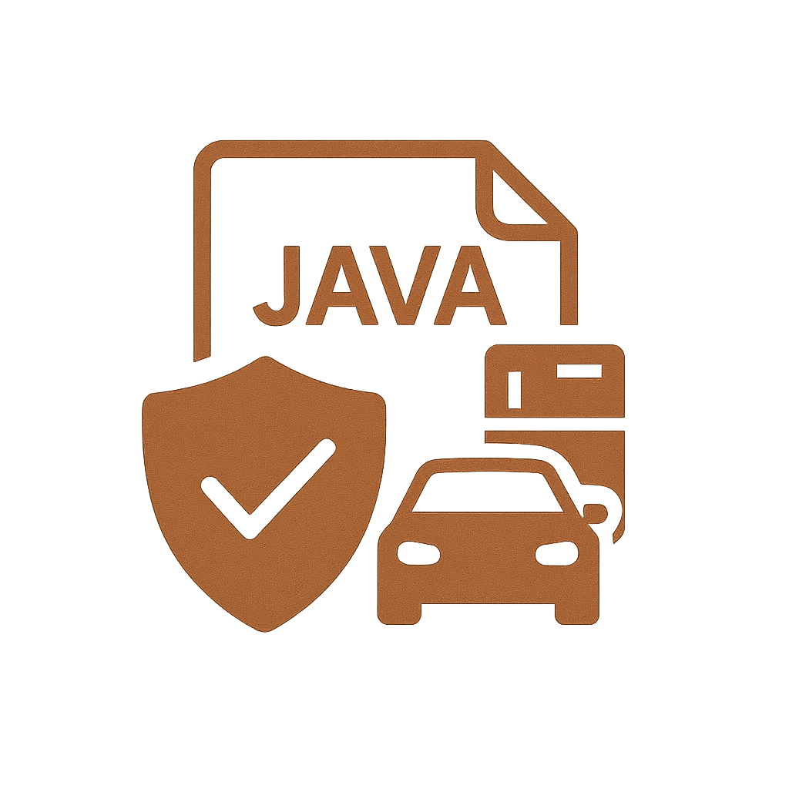

  

# 🛡️ UP Seguros — Java Swing Insurance Simulator

  
  
  
  
  
  
  
  
  

---

## 📄 Descrição / Description

| 🇧🇷 **PT-BR** | 🇺🇸 **EN** |
| --- | --- |
| Aplicação desktop desenvolvida em **Java Swing**, composta por múltiplas telas e classes de domínio para simulação de seguros (Carro, Moto, Caminhão, Eletrodomésticos, Notebooks e mais). O projeto foi originalmente estruturado no **NetBeans**, contendo arquivos `.form` e classes compiladas `.class`. | Desktop application developed using **Java Swing**, featuring multiple forms and domain classes for insurance simulation (Car, Motorcycle, Truck, Home Appliances, Notebooks, etc.). The project was originally structured in **NetBeans**, including `.form` files and compiled `.class` artifacts. |

---

## ✨ Funcionalidades / Features

| 🇧🇷 **Recursos (PT-BR)** | 🇺🇸 **Features (EN)** |
| --- | --- |
| • GUI em Java Swing • Múltiplas telas (Tela1…Tela7) • Classes de domínio com regras básicas • Estrutura de projeto legada do NetBeans • Código 100% Java “puro” | • Java Swing GUI • Multiple screens (Tela1…Tela7) • Domain classes with basic rules • Legacy NetBeans structure • 100% pure Java code |

---

## ▶️ Como executar / How to Run

| 🇧🇷 **PT-BR** | 🇺🇸 **EN** |
| --- | --- |
| Projeto Java puro sem Maven/Gradle. Pode ser executado via terminal ou NetBeans. | Pure Java project without Maven/Gradle. Can be executed via terminal or NetBeans. |

---

### 🔧 Opção A — Terminal (JDK instalado)

**Compilar:**

    mkdir -p out
    javac -d out projeto/*.java

**Executar (exemplo Tela1):**

    java -cp out projeto.Tela1

---

### 🖥️ Opção B — NetBeans (GUI Builder)

| 🇧🇷 **PT-BR** | 🇺🇸 **EN** |
| --- | --- |
| File → Open Project… Edite telas `.form` pelo GUI Builder Defina a classe principal (ex.: `projeto.Tela1`) e clique em Run | File → Open Project… Edit `.form` screens via GUI Builder Set main class (e.g., `projeto.Tela1`) and run |

---

## 🗂️ Estrutura / Structure

| 🇧🇷 **Estrutura (PT-BR)** | 🇺🇸 **Structure (EN)** |
| --- | --- |
| projeto/*.java projeto/*.form *.class (build legado) manifest.mf icon/icon.png (ícone README) | projeto/*.java projeto/*.form *.class (legacy build) manifest.mf icon/icon.png (README icon) |

---

## 📄 Licença / License

Projeto licenciado sob MIT License.  
Project licensed under the MIT License.

---

## 👤 Autor | Author

Criado por João Albero · 2025  
Created by João Albero · 2025